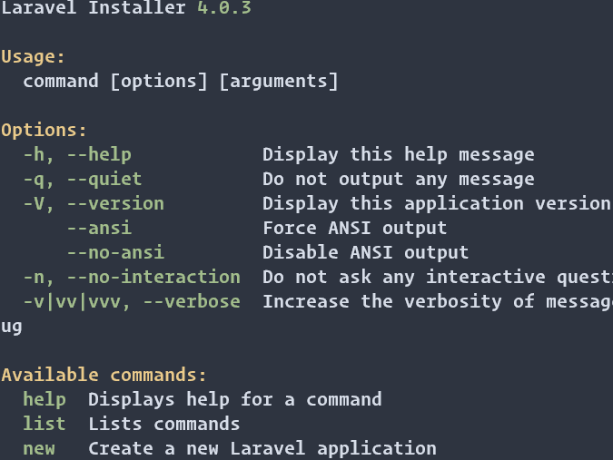

# Installation de laravel

### Installer l'outil de ligne de commande 'laravel/installer'
Ouvrez un terminal et tapez la commande suivante :
```bash
composer global require laravel/installer
```
Pour pouvoir se servir de ce programme, on doit ajouter le chemin de l'exécutable de ce programme à notre $PATH.
Sous linux, il est courant de modifier le fichier `.profile`
On ouvre le fichier :
```bash
vim .profile
```
On appuie sur la touche i pour mettre vim en mode écriture, et on ajoute les lignes suivantes :
```vim
PATH="$HOME/.composer/vendor/bin:$PATH"
```
Ensuite la séquence de touches suivante pour enregistrer la modification et quitter vim `esc :wq`

Une dernière commande pour que le système prenne en compte la modification : `source .profile`.

À partir de la, on peut taper la commande `laravel` et on obtient ce résultat :



On est prêt à créer une application laravel :
```bash
laravel new blog
```
Une fois cette commande exécutée, on entre dans le dossier blog :
```bash
cd blog
``` 
Et on tape la commande suivante pour démarrer le serveur laravel à l'adresse http://127.0.0.1:8000 par défaut.
```bash
php artisan serve
``` 
Ouvrez le navigateur et aller a l'URL suivante : [blog](http://127.0.0.1:8000)  
Si vous souhaitez un autre port que le 8000, une option existe, un exemple pour le port 5000 :
```bash
php artisan serve --port 5000
```
