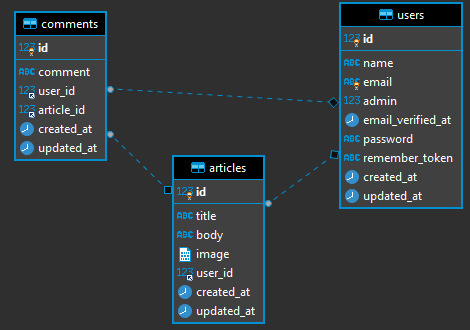

# Les migrations

Créez une base de données `blog` et modifier les informations de connection dans le fichier `.env` pour pouvoir vous connecter.

Nous allons maintenant créer plusieurs fichiers qui vont nous servir à ajouter les tables nécessaires à notre base de données.
 
 Dans le dossier `database/migrations`, des fichiers sont déjà présents, examinons le fichier `create_users`, plus particulièrement la méthode `up()` :
```php
public function up()
{
    Schema::create('users', function (Blueprint $table) {
        $table->id();
        $table->string('name');
        $table->string('email')->unique();
        $table->timestamp('email_verified_at')->nullable();
        $table->string('password');
        $table->rememberToken();
        $table->timestamps();
    });
}
```
Cette méthode créera une table users, les champs `name`, `email` et `password` seront des strings, et le champ `email` sera unique.  
La méthode `$table->id()` créera un champ id, clé primaire, auto-increment.  
Le champ `email_verified_at` sera un timestamp.  
La méthode `$table->rememberToken()` créera un booléen qui sera utilisé si l'utilisateur décide de cliquer l'input radio 'Remember me' au moment du login.  
Enfin, la méthode `$table->timestamps()` créera un champ created_at `timestamp` et un champ updated_at `timestamp`  

#### Création de migrations
Entrez la commande suivante :
```bash
php artisan make:migration create_articles_table
```
La table s'appellera `articles` mais la convention laravel est de nommer le fichier 'create_articles_table'.  
Il est important de respecter cette convention, laravel se servant des noms de fichiers pour automatiser les tâches.  
Un fichier est créé dans le dossier `database/migrations`, et le squelette est déjà en place, il ne reste qu'à décrire les champs qu'on veut.  

```php
public function up()
{
    Schema::create('articles', function (Blueprint $table) {
        $table->id();
        $table->string('title', 255);
        $table->text('body');
        $table->string('image');
        $table->foreignId('user_id')->nullable();
        $table->timestamps();
        $table->foreign('user_id')->references('id')->on('users')->onDelete('SET NULL');
    });
}
```
La seule particularité est qu'on a rendu la clé étrangère `user_id` 'nullable', de cette manière l'auteur peut effacer son compte mais on peut garder ses articles.
Si vous avez besoin de plus d'explications sue les méthodes utilisées, votre formateur saura vous répondre.

Créons une table pour les commentaires :
```bash
php artisan make:migration create_comments_table
```
```php
public function up()
{
    Schema::create('comments', function (Blueprint $table) {
        $table->id();
        $table->string('comment', 255);
        $table->foreignId('user_id');
        $table->foreignId('article_id');
        $table->timestamps();
        $table->foreign('user_id')->references('id')->on('users')->onDelete('cascade');
        $table->foreign('article_id')->references('id')->on('articles')->onDelete('cascade');
    });
}
```
Une fois de plus, rien de compliqué, on effacera les commentaires si l'utilisateur efface son compte ou si l'article est supprimé.  
On modifie maintenant le fichier `create_users` pour y ajouter un booléen `admin` dont le défaut sera `false` :
 ```php
public function up()
{
    Schema::create('users', function (Blueprint $table) {
        // ajout
        $table->boolean('admin')->default(false);
    });
}
```
On peut maintenant taper la commande suivante :
```bash
php artisan migrate
```
Voici ce que vous devez obtenir :

  

Si des erreurs se produisent, corrigez les dans vos fichiers de migrations, puis tapez la commande suivante :
```bash
php artisan migrate:fresh
```
Cette commande effacera toutes les tables, et recommencera tout depuis le début.

_Note sur les clés étrangères :_
Une autre convention laravel est de nommer les clés étrangères `table_id`, ou `table` est nom de la table au singulier.  
Quand on verra les modèles et les relations `eloquent`, on verra que laravel recherche automatiquement les noms sous cette forme. 

#### Factory
Maintenant qu'on a notre BDD, on a besoin de données, pour en créer, laravel est fourni avec une librairie appelée `faker` qui permet de générer des fausses données et de les enregistrer par la suite en BDD.
Dans le dossier `database/factory`, un exemple nous est fourni pour générer des utilisateurs, modifions le pour y ajouter le champ `admin` que nous avons créé plus tôt.  
Attention, ici nous utilisons la syntaxe `laravel 8`, ou la génération de données se fait avec des classes, avant laravel 8, c'était des fonctions, vous n'aurez aucun mal à vous y retrouver quand vous devrez gérer ce type de code.
```php
public function definition()
{
    return [
        'name' => $this->faker->name,
        'email' => $this->faker->unique()->safeEmail,
        'email_verified_at' => now(),
        'admin' => false,
        'password' => '$2y$10$92IXUNpkjO0rOQ5byMi.Ye4oKoEa3Ro9llC/.og/at2.uheWG/igi', // password
        'remember_token' => Str::random(10),
    ];
}
```
Créons les factory pour nos autres tables :
```bash
php artisan make:factory ArticleFactory  && php artisan make:factory CommentFactory
```

Les articles :
```php
public function definition()
{
    return [
        'title' => $this->faker->sentence(15), // on veut 15 mots
        'body' => $this->faker->paragraph(50), // on veut 50 phrases
        'user_id' => 1,
        'image' => $this->faker->image('public/images'),
    ];
}
```
On garde les choses simples pour l'instant et on code l'`user_id` en 'dur'. 

Maintenant, les commentaires :
```php
public function definition()
{
    return [
        'comment' => $this->faker->text(50),
        'user_id' => 2,
        'article_id' => 2,
    ];
}
```
Même chose pour les commentaires, on assigne la même id pour l'instant pour les `user_id` et `article_id`.
Ce code ne fonctionnera pas en l'état, on a besoin de voir d'autres notions avant.
#### Tinker
Dans le dossier `app/Models`, on a un modèle `User` présent dans le fichier User.php, on va pouvoir tester si tout fonctionne comme attendu.
Ouvrez ce fichier et modifiez la ligne suivante pour ajouter le champ `admin` :
```php
 protected $fillable = [
    'name', 'email', 'password', 'admin' // on ajoute admin
];
```
Tinker est un outil en ligne de commande qui permet d'interagir avec l'application directement dans le terminal.
Notez que si vous modifiez un fichier, il vous faudra redémarrer tinker pour que la modification soit prise en compte.
```bash
php artisan tinker
```
Ensuite :
```php
User::factory()->create();
```
Voici ce que vous devez obtenir, un utilisateur a été créé et enregistré en BDD.
Ceci est possible grâce au `trait` `HasFactory` utilisé par la classe `User`

 

C'est tout pour l'instant avec les migrations. Nous créerons plus tard les autres données. Auparavant, il nous faut voir les modèles.
