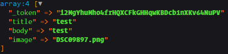
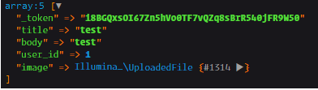

# Création de resources

Jusqu'à maintenant, nous avons vu plusieurs techniques pour lire la BDD, il est temps de créer des formulaires et de les poster.

- Créez un fichier `articles/create.blade.php`. qui comporte le formulaire (method="POST" action="articles/create" enctype="multipart/form-data"). N'oubliez pas la section titre.
- Créez un fichier `partials/article-form.blade.php` aui contient les champs du formulaire nécessaire pour créer un article.
- Incluez le fichier `partials` dans la vue `create`.
- Faites une route dans le fichier `web.php`.
- Créer l'action correspondante dans le contrôleur `ArticlesController`, la méthode devra s'appeler `create`.
- Créer le lien dans le fichier `layouts/master.blade.php`.

**À propos du CRUD et laravel** :  
Dans les contrôleurs, La communauté laravel utilise ces noms de méthodes pour le CRUD :
- `index` pour lister les resources.
- `show` pour lire une resource. 
- `create` pour créer une resource. 
- `store` pour enregistrer une resource. 
- `edit` pour éditer une resource.
- `update` pour mettre à jour une resource.
- `destroy` pour effacer une resource.

---
Remplissez et envoyer le formulaire, et admirez l'erreur que vous allez obtenir.
Nous n'avons pas de routes, ni de méthodes pour ce formulaire.
On crée la route :
```php
Route::post('/articles/create', [ArticlesController::class, 'store']);
```
Et la méthode dans le contrôleur :
```php
public function store(Request $request)
{
    dd($request->all());
}
```
On passe `Request $request` en arguments pour obtenir notre formulaire.

Si tout se passe comme prévu, vous devez obtenir une page d'erreur, `419 Page Expired`, ceci est dû à la protection qu'offre le framework contre les attaques de type [csrf](https://fr.wikipedia.org/wiki/Cross-site_request_forgery).
Pour y remédier, on insère un morceau de code dans le dans le formulaire 
```blade
<form>
    @csrf
    {{-- OU --}}
    {{ csrf_field() }}
</form>
```
Ensuite faites `f12` pour voir l'input qui s'est ajouté dans le formulaire. C'est un token unique correspondant à la session actuelle et qui permet de s'assurer qu'on peut poster sur le site en toute sécurité.

Maintenant on peut voir notre requête :  


On peut donc commencer à valider chaque champ.

#### La validation
Plusieurs méthodes sont disponibles pour valider les champs de formulaires, nous allons voir la plus simple, qui est adaptée aux petites applications.
Nous n'avons pas pour l'instant de sessions utilisateur pour vérifier qu'un utilisateur a la permission de créer un article, nous allons devoir tricher pour obtenir le champ `user_id` et mettre les permissions de côté pour le moment.  
`ArticlesController`
```php
use App\Models\User;

public function store(Request $request)
{
    // vérification des permissions plus tard
    $user = User::find(1);
    $request['user_id'] = $user->id;

    $this->validate($request, [
        'title' => 'required|string',
        'body' => 'required|string',
        'user_id' => 'required|numeric|exists:users,id',
    ]);
    
    dd($request->all());
}
```
Voici ce que vous devez obtenir :  


Si on arrive là, c'est que la requête est valide, il nous reste qu'a enregistré l'article :
```php
$art = Article::create($request->all());
dd($art);
```
Et c'est tout. L'article est mal enregistré, mais il l'est. L'image n'a pas été correctement gérer et si des erreurs se produisent, on a rien fait pour les gérer. On n'a pas non plus de message d'information ou de redirection. Cela fera partie d'une autre leçon.
